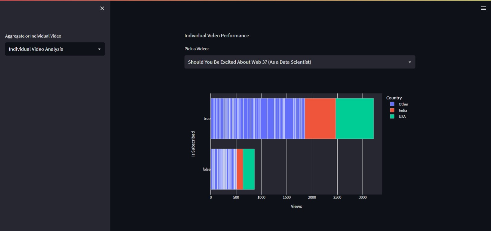
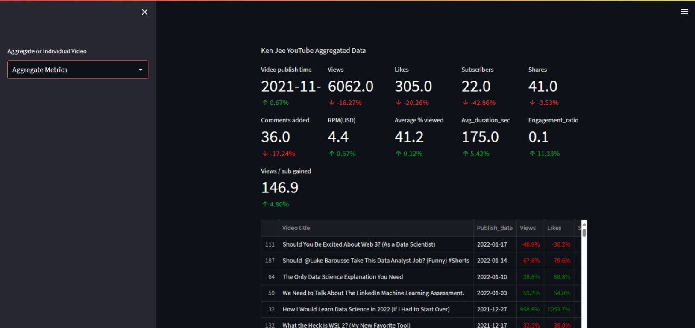

# YouTube Channel Video Performance Analysis

This is a web application built using **Streamlit** to analyze the performance of videos from the YouTube channel **Ken Jee**, using data sourced from [Kaggle](https://www.kaggle.com/datasets/kenjee/ken-jee-youtube-data). The app allows users to explore video metrics such as views, likes, and other key performance indicators (KPIs).

## Features

- **Video Performance Metrics**: Analyze the performance of each video in terms of views, likes, and comments.
- **Interactive Visualizations**: Explore data through interactive plots, graphs, and tables.
- **Time-Based Analysis**: Understand how video performance evolves over time.
- **Comparative Analysis**: Compare the performance of videos against one another based on various metrics.

## Technologies Used

- **Streamlit**: For building the web interface.
- **Pandas**: For data manipulation and analysis.
- **Plotly**: For generating interactive visualizations.
- **NumPy**: For numerical operations.

## Installation

To run this project locally, follow these steps:

1. Clone the repository:

   ```bash
   git clone https://github.com/muhammadderic/storespace/vid-performance-analysis.git
   ```

2. Navigate to the project directory:

   ```bash
   cd video-performance-analysis
   ```

3. Install the required dependencies:

   ```bash
   pip install -r requirements.txt
   ```

4. Run the Streamlit app:

   ```bash
   streamlit run streamlit_app.py
   ```

## How to Use

1. Once the app is running, open your browser and go to `http://localhost:8501`.
2. Use the sidebar to select specific metrics, video categories, or time ranges.
3. Explore various visualizations and insights generated from the video data.

## Screenshots

Here are a few screenshots of the application:

<div style="display: flex; flex-wrap: wrap; justify-content: space-between;">
    
    
</div>
<div style="display: flex; flex-wrap: wrap; justify-content: space-between;">
    
</div>

## Acknowledgments

- Special thanks to [Ken Jee](https://www.youtube.com/watch?v=Yk-unX4KnV4&ab_channel=KenJee) for the inspiration.

## Contact

If you have any questions or want to reach out, feel free to contact me via:

- **LinkedIn**: [LinkedIn](https://www.linkedin.com/in/muhammad-donny-ericson/)
- **GitHub**: [muhammadderic](https://github.com/muhammadderic)

Feel free to share any feedback or suggest enhancements!

## References

- [Streamlit Documentation](https://docs.streamlit.io/)
- [Pandas Documentation](https://pandas.pydata.org/pandas-docs/stable/)
- [Plotly Documentation](https://plotly.com/python/)
- [Ken Jee YouTube Channel](https://www.youtube.com/c/KenJee1)
- [Kaggle Dataset](x) (Replace `x` with the link to the Kaggle dataset)

---

**Developed By**: [Muhammad Deric](https://github.com/muhammadderic)